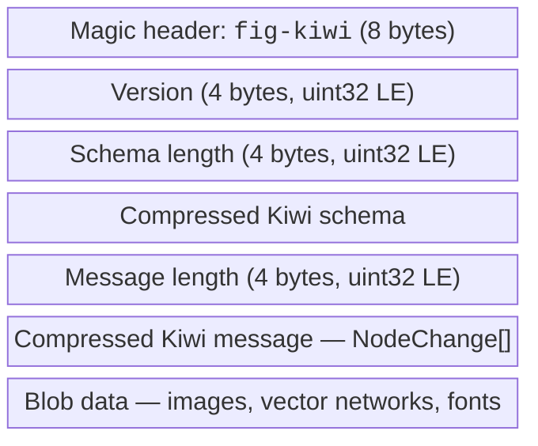
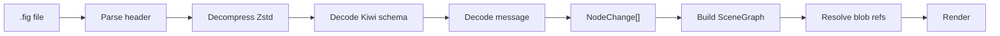
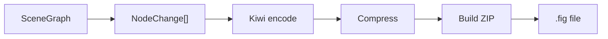
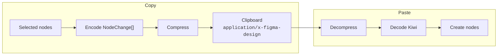

# File Format

## .fig File Structure

A `.fig` file is a ZIP archive containing a Kiwi-encoded binary message:

## Import Pipeline

## Export Pipeline

Export uses <kbd>⌘</kbd><kbd>S</kbd> (Save) and <kbd>⇧</kbd><kbd>⌘</kbd><kbd>S</kbd> (Save As) with native OS dialogs on the desktop app. The exported file includes a `thumbnail.png` required by Figma for file preview.

Compression uses Zstd via Tauri Rust command on desktop, with deflate fallback in the browser.

## Kiwi Binary Codec

The codec handles Figma's 194-definition Kiwi schema with `NodeChange` as the central type (~390 fields). Key components:

| Module | Purpose |
|--------|---------|
| `kiwi-schema` | Kiwi parser (from [evanw/kiwi](https://github.com/nicolo-ribaudo/kiwi)), patched for ESM and sparse field IDs |
| `codec.ts` | Encode/decode messages using the Kiwi schema |
| `protocol.ts` | Wire format parsing and message type detection |
| `schema.ts` | 194 message/enum/struct definitions |

### Sparse Field IDs

Figma's schema uses non-contiguous field IDs (e.g. 1, 2, 5, 10 with gaps). The kiwi-schema parser handles this correctly.

### Compression

`.fig` files use Zstd compression for both the schema and message payloads. Decompression uses the `fzstd` library. For export, Zstd compression is offloaded to a Tauri Rust command on the desktop app (better performance, correct frame headers). In the browser, deflate via `fflate` is used as a fallback.

## Supported Formats

| Format | Import | Export |
|--------|--------|--------|
| `.fig` (Figma) | ✅ | ✅ |
| `.svg` | Planned | Planned |
| `.png` | Planned | Planned |
| `.pdf` | — | Planned |

## Clipboard Format

Copy/paste uses the same Kiwi binary encoding:

This enables bidirectional clipboard between OpenPencil and Figma.
